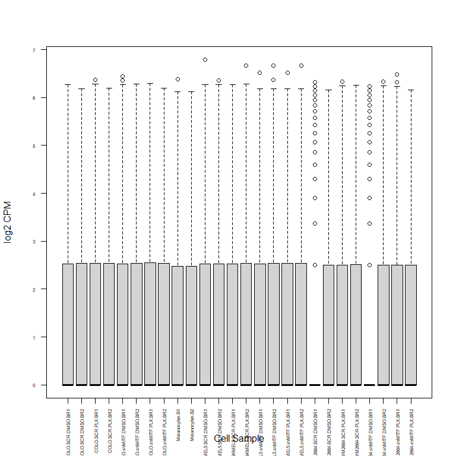

melanoma_ATAC
================
Konnie Guo
2/26/2022

## ATAC-seq data

Read in raw ATAC .narrowPeak files for each sample.

``` r
# files<-list.files("data/ATAC-seq/narrowPeak", pattern = "*bfilt.narrowPeak", recursive = T)
# 
# raw<-foreach(file=files) %do% read.table(paste("data/ATAC-seq/",file,sep=""), header = F, sep = "\t")
# names(raw)<-gsub("_R1.trim.merged.nodup.tn5.pval0.05.300K.bfilt.narrowPeak|-AGGTTGGG-ATAGAGAG_S19_L001_R1_001.trim.merged.nodup.tn5.pval0.05.300K.bfilt.narrowPeak|-GTGTGGTG-ATAGAGAG_S20_L001_R1_001.trim.merged.nodup.tn5.pval0.05.300K.bfilt.narrowPeak", "", basename(files)) 
# status<-names(raw)
# 
# tmp <- mapply(cbind, raw, "celltype"=status, SIMPLIFY=F)
# 
# tmp<-Map(function(x, n) setNames(x, c("chr", "start", "stop", "celltype")),  tmp, names(tmp))

#note that since these peaks are combined from multiple narrowPeak files, the peakIDs are NOT unique
all_peaks <- read.table("data/ATAC-seq/narrowPeak/ATAC_all_merged.narrowPeak", sep="\t",header = F)
colnames(all_peaks)<-c("chr","start","stop","peakID","score","strand","signalVal","pVal","qVal","peak")
peaks<-makeGRangesFromDataFrame(all_peaks,
                               seqinfo = Seqinfo(genome="hg38"),
                                keep.extra.columns = T)
peaks<-trim(peaks)
consensuspeaks<-reduce(peaks)
seqinfo(consensuspeaks)

#create merged peak table with unique peak IDs
mergedpeaks<-data.frame(GeneID=paste("Pk",1:length(consensuspeaks),sep="_"),
  Chr=seqnames(consensuspeaks),
  Start=start(consensuspeaks)-1,
  End=end(consensuspeaks),
  strands=strand(consensuspeaks)
)

# write.table(mergedpeaks,"data/ATAC-seq/melanoma_ATAC_mergedpeaks_nontrimmed.saf",sep = "\t",col.names = T,row.names = F,quote = F)
```

## Count table

Make counts table for each sample using Rsubread

\*note that I had to convert .narrowPeak files to .bam using bedtools
bedToBam

``` r
bam <-list.files("data/ATAC-seq/bam", pattern = "*.bam", recursive = T)
counts<-featureCounts(paste("data/ATAC-seq/bam/",bam,sep = ""), annot.ext="data/ATAC-seq/melanoma_ATAC_mergedpeaks.saf")
ct_table<-counts$counts
colnames(ct_table)<-gsub("_R1.trim.merged.nodup.tn5.pval0.01.300K.bfilt.narrowPeak.bam|-AGGTTGGG-ATAGAGAG_S19_L001_R1_001.trim.merged.nodup.tn5.pval0.01.300K.bfilt.narrowPeak.bam|-GTGTGGTG-ATAGAGAG_S20_L001_R1_001.trim.merged.nodup.tn5.pval0.01.300K.bfilt.narrowPeak.bam", "", colnames(ct_table))
# write.table(ct_table,"data/ATAC-seq/melanoma_ATAC_counttable.txt",sep="\t",col.names = T, row.names = T, quote = F)
```

## Counts normalization

Normalize counts (CPM)

``` r
mergedpeaks<-read.table("data/ATAC-seq/melanoma_ATAC_mergedpeaks.saf", sep="\t",header = T)
samples<-read.table("data/ATAC-seq/melanoma_ATAC_samplemetadata.csv", header = T, sep=",")
samples[9:10,4]<-"DMSO"
samples[9:10,5]<-"SCR"

samples$group<- ifelse(grepl("Melanocytes", samples$file), "melanocyte", "melanoma")

counts<-read.table("data/ATAC-seq/melanoma_ATAC_counttable.txt", header = T, sep="\t")
colnames(counts)<-gsub("_merged.bam", "", colnames(counts))

counts_cpm<-data.frame(apply(counts,2, function(x) (x/sum(x))*1000000))
counts_comp_filt<-counts_cpm[rowSums(counts_cpm > 0.5) >= 2, ]
nrow(counts_comp_filt)
```

    ## [1] 185084

``` r
log2cpm<-log2(counts_cpm+1)

# write.table(log2cpm,"data/ATAC-seq/atac_log2cpm.txt",sep = "\t", col.names = T, row.names = T, quote = F)
# write.table(counts,"data/ATAC-seq/atac_counts_filt.txt",sep = "\t", col.names = T, row.names = T, quote = F)
```

## Plots

Plotting log2cpm normalized data

``` r
boxplot(log2cpm, xlab = "Cell Sample", ylab= "log2 CPM", cex.axis=0.5, las=2)
```

<!-- -->

``` r
#PCA
prcomp<-prcomp(t(log2cpm))
summary(prcomp)
```

    ## Importance of components:
    ##                             PC1      PC2       PC3       PC4       PC5      PC6
    ## Standard deviation     287.2472 201.9032 160.19098 143.97448 113.04952 98.84354
    ## Proportion of Variance   0.3168   0.1565   0.09852   0.07958   0.04907  0.03751
    ## Cumulative Proportion    0.3168   0.4733   0.57182   0.65141   0.70047  0.73799
    ##                             PC7      PC8     PC9     PC10     PC11     PC12
    ## Standard deviation     85.45464 83.79964 80.2010 76.79883 71.85714 61.92486
    ## Proportion of Variance  0.02804  0.02696  0.0247  0.02264  0.01982  0.01472
    ## Cumulative Proportion   0.76602  0.79298  0.8177  0.84032  0.86015  0.87487
    ##                            PC13    PC14    PC15     PC16     PC17     PC18
    ## Standard deviation     58.03992 56.3719 53.0284 52.00435 51.59355 50.34727
    ## Proportion of Variance  0.01293  0.0122  0.0108  0.01038  0.01022  0.00973
    ## Cumulative Proportion   0.88780  0.9000  0.9108  0.92118  0.93140  0.94114
    ##                            PC19    PC20     PC21     PC22     PC23     PC24
    ## Standard deviation     48.88943 47.8799 47.03750 46.85913 46.60648 45.76265
    ## Proportion of Variance  0.00918  0.0088  0.00849  0.00843  0.00834  0.00804
    ## Cumulative Proportion   0.95031  0.9591  0.96761  0.97604  0.98438  0.99242
    ##                            PC25      PC26
    ## Standard deviation     44.43292 2.634e-11
    ## Proportion of Variance  0.00758 0.000e+00
    ## Cumulative Proportion   1.00000 1.000e+00

``` r
pca <- as.data.frame(prcomp$x)
pca$samples<-rownames(prcomp$x)
pca<-cbind(pca, samples[,3:4])
percentage <- round(prcomp$sdev^2 /sum(prcomp$sdev^2)*100, 2)
percentage <- paste(colnames(pca), "(", paste(as.character(percentage), "%", " )", sep="") )

ggplot(pca, aes(x = PC1, y = PC2, color=cell_type, shape=drug)) + geom_point(size=3) +xlab(percentage[1]) + ylab(percentage[2])#+geom_text(aes(label=all.pca$sample))
```

<!-- -->

``` r
corrplot(cor(log2cpm-apply(log2cpm,1,mean)),
         method = "color", 
         order = "hclust", 
         tl.cex=1, 
         mar=c(0.001,0.001,0.001,0.001),
         #addrect = 3,
         rect.lwd=0.5,
         title = "Pearson correlation among log2 CPM for all samples"
)
```

<!-- -->

``` r
corrplot(cor(log2cpm),
         method = "color", 
         order = "hclust", 
         tl.cex=1, 
         mar=c(0.001,0.001,0.001,0.001),
         #addrect = 3,
         rect.lwd=0.5,
         title = "Pearson correlation among log2 CPM for all samples"
)
```

<!-- --> # Differential
Peak Analysis

### Normalization and fitting model

Here we run DESeq2 on the count matrix. The design matrix looks for
initial differences between melanoma and melanocyte, compared all
together (all melanoma vs melanocytes) and individually (i.e. melanocyte
vs COLO, melanocyte vs WM, melanocyte vs SKMEL5).

``` r
dds <- DESeqDataSetFromMatrix(countData = counts[grep("SCR.DMSO|Melanocytes",names(counts))],
                              colData = samples[grep("SCR-DMSO|Melanocytes",samples$file),],
                              design = ~group)
```

    ## Warning in DESeqDataSet(se, design = design, ignoreRank): some variables in
    ## design formula are characters, converting to factors

``` r
dds
```

    ## class: DESeqDataSet 
    ## dim: 338216 8 
    ## metadata(1): version
    ## assays(1): counts
    ## rownames(338216): Pk_1 Pk_2 ... Pk_338215 Pk_338216
    ## rowData names(0):
    ## colnames(8): COLO.SCR.DMSO.BR1 COLO.SCR.DMSO.BR2 ...
    ##   WM2664.SCR.DMSO.BR1 WM2664.SCR.DMSO.BR2
    ## colData names(6): file samples ... KD group

``` r
dds <- DESeq(dds)
```

    ## estimating size factors

    ## estimating dispersions

    ## gene-wise dispersion estimates

    ## mean-dispersion relationship

    ## -- note: fitType='parametric', but the dispersion trend was not well captured by the
    ##    function: y = a/x + b, and a local regression fit was automatically substituted.
    ##    specify fitType='local' or 'mean' to avoid this message next time.

    ## final dispersion estimates

    ## fitting model and testing

``` r
res <- results(dds)
res
```

    ## log2 fold change (MLE): group melanoma vs melanocyte 
    ## Wald test p-value: group melanoma vs melanocyte 
    ## DataFrame with 338216 rows and 6 columns
    ##            baseMean log2FoldChange     lfcSE       stat    pvalue      padj
    ##           <numeric>      <numeric> <numeric>  <numeric> <numeric> <numeric>
    ## Pk_1       0.000000             NA        NA         NA        NA        NA
    ## Pk_2       0.374364       1.405595   2.77495  0.5065295  0.612485  0.946291
    ## Pk_3       1.987180      -0.045851   1.02005 -0.0449498  0.964147  0.993512
    ## Pk_4       0.241700       0.915960   1.84992  0.4951334  0.620506  0.946291
    ## Pk_5       0.000000             NA        NA         NA        NA        NA
    ## ...             ...            ...       ...        ...       ...       ...
    ## Pk_338212  0.124364       0.435064   1.66629   0.261098  0.794017  0.946291
    ## Pk_338213  0.000000             NA        NA         NA        NA        NA
    ## Pk_338214  0.250817      -1.005888   1.92194  -0.523371  0.600716  0.946291
    ## Pk_338215  0.370327       1.395558   2.74476   0.508444  0.611142  0.946291
    ## Pk_338216  0.000000             NA        NA         NA        NA        NA

``` r
summary(res)
```

    ## 
    ## out of 193387 with nonzero total read count
    ## adjusted p-value < 0.1
    ## LFC > 0 (up)       : 0, 0%
    ## LFC < 0 (down)     : 0, 0%
    ## outliers [1]       : 0, 0%
    ## low counts [2]     : 0, 0%
    ## (mean count < 0)
    ## [1] see 'cooksCutoff' argument of ?results
    ## [2] see 'independentFiltering' argument of ?results

``` r
resultsNames(dds)
```

    ## [1] "Intercept"                    "group_melanoma_vs_melanocyte"

``` r
res <- lfcShrink(dds,coef=2,res=res, type = 'normal')
```

    ## using 'normal' for LFC shrinkage, the Normal prior from Love et al (2014).
    ## 
    ## Note that type='apeglm' and type='ashr' have shown to have less bias than type='normal'.
    ## See ?lfcShrink for more details on shrinkage type, and the DESeq2 vignette.
    ## Reference: https://doi.org/10.1093/bioinformatics/bty895

``` r
EnhancedVolcano(res, lab = rownames(res), x = 'log2FoldChange', y = 'pvalue')
```

<!-- -->
### Plotting of all melanoma vs melanocyte differential peaks as found
by DESeq2

``` r
resOrdered <- res[order(res$log2FoldChange),]
resSig <- subset(resOrdered, pvalue < 0.05)
nrow(resSig)
```

    ## [1] 2190

``` r
#top20_counts<-counts(dds,normalized=T)[resSig@rownames,]
top_counts<-log2cpm[resSig@rownames,]
top_counts<-top_counts[grep("SCR.DMSO|Melanocytes",names(top_counts))]
anno<-as.data.frame(colData(dds)[,c("cell_type")])
rownames(anno)<-colnames(top_counts)
colnames(anno)<-"Cell Type"
#breaksList = seq(0, 4, by=0.05)
pheatmap(top_counts,
         # color = colorRampPalette(rev(brewer.pal(n = 7, name = "RdYlBu")))(length(breaksList)),
         # breaks = breaksList, 
         cluster_rows = F, 
         cluster_cols = T,
         annotation_col = anno,
         show_rownames = F)
```

<!-- -->

``` r
#make table of all differential peaks with coords, DESeq2 results, and count table
diff_peaks<-merge(as.data.frame(res),log2cpm[grep("SCR.DMSO|Melanocytes",names(log2cpm))],by=0)
colnames(diff_peaks)[1]<-"GeneID"
diff_peaks<-merge(mergedpeaks,diff_peaks,by="GeneID")
# write.table(diff_peaks,"data/ATAC-seq/diffPeaks_allmelanoma_vs_melanocyte.csv",sep=",", row.names = F,col.names = T,quote = F)
```

## COLO cell line vs Melanocytes

``` r
dds <- DESeqDataSetFromMatrix(countData = counts[grep("COLO.SCR.DMSO|Melanocytes",names(counts))],
                              colData = samples[grep("COLO-SCR-DMSO|Melanocytes",samples$file),],
                              design = ~group)
```

    ## Warning in DESeqDataSet(se, design = design, ignoreRank): some variables in
    ## design formula are characters, converting to factors

``` r
dds
```

    ## class: DESeqDataSet 
    ## dim: 338216 4 
    ## metadata(1): version
    ## assays(1): counts
    ## rownames(338216): Pk_1 Pk_2 ... Pk_338215 Pk_338216
    ## rowData names(0):
    ## colnames(4): COLO.SCR.DMSO.BR1 COLO.SCR.DMSO.BR2 Melanocytes.B1
    ##   Melanocytes.B2
    ## colData names(6): file samples ... KD group

``` r
dds <- DESeq(dds)
```

    ## estimating size factors

    ## estimating dispersions

    ## gene-wise dispersion estimates

    ## mean-dispersion relationship

    ## -- note: fitType='parametric', but the dispersion trend was not well captured by the
    ##    function: y = a/x + b, and a local regression fit was automatically substituted.
    ##    specify fitType='local' or 'mean' to avoid this message next time.

    ## final dispersion estimates

    ## fitting model and testing

``` r
res <- results(dds)
res
```

    ## log2 fold change (MLE): group melanoma vs melanocyte 
    ## Wald test p-value: group melanoma vs melanocyte 
    ## DataFrame with 338216 rows and 6 columns
    ##            baseMean log2FoldChange     lfcSE         stat    pvalue      padj
    ##           <numeric>      <numeric> <numeric>    <numeric> <numeric> <numeric>
    ## Pk_1           0.00             NA        NA           NA        NA        NA
    ## Pk_2           0.25    1.44263e+00   4.99749  2.88671e-01  0.772833         1
    ## Pk_3           2.00    1.33964e-06   1.63685  8.18427e-07  0.999999         1
    ## Pk_4           0.00             NA        NA           NA        NA        NA
    ## Pk_5           0.00             NA        NA           NA        NA        NA
    ## ...             ...            ...       ...          ...       ...       ...
    ## Pk_338212      0.00             NA        NA           NA        NA        NA
    ## Pk_338213      0.00             NA        NA           NA        NA        NA
    ## Pk_338214      0.50   -1.22686e-05   4.95344 -2.47679e-06  0.999998         1
    ## Pk_338215      0.25    1.44263e+00   4.99749  2.88671e-01  0.772833         1
    ## Pk_338216      0.00             NA        NA           NA        NA        NA

``` r
summary(res)
```

    ## 
    ## out of 157431 with nonzero total read count
    ## adjusted p-value < 0.1
    ## LFC > 0 (up)       : 0, 0%
    ## LFC < 0 (down)     : 0, 0%
    ## outliers [1]       : 0, 0%
    ## low counts [2]     : 0, 0%
    ## (mean count < 0)
    ## [1] see 'cooksCutoff' argument of ?results
    ## [2] see 'independentFiltering' argument of ?results

``` r
resultsNames(dds)
```

    ## [1] "Intercept"                    "group_melanoma_vs_melanocyte"

``` r
res <- lfcShrink(dds,coef=2,res=res, type = 'normal')
```

    ## using 'normal' for LFC shrinkage, the Normal prior from Love et al (2014).
    ## 
    ## Note that type='apeglm' and type='ashr' have shown to have less bias than type='normal'.
    ## See ?lfcShrink for more details on shrinkage type, and the DESeq2 vignette.
    ## Reference: https://doi.org/10.1093/bioinformatics/bty895

``` r
EnhancedVolcano(res, lab = rownames(res), x = 'log2FoldChange', y = 'pvalue')
```

<!-- -->
Plotting of COLO vs melanocytes differential peaks as found by DESeq2

``` r
resOrdered <- res[order(res$log2FoldChange),]
resSig <- subset(resOrdered, pvalue < 0.05)
nrow(resSig)
```

    ## [1] 1817

``` r
#top20_counts<-counts(dds,normalized=T)[resSig@rownames,]
top_counts<-log2cpm[resSig@rownames,]
top_counts<-top_counts[grep("COLO.SCR.DMSO|Melanocytes",names(top_counts))]
anno<-as.data.frame(colData(dds)[,c("cell_type")])
rownames(anno)<-colnames(top_counts)
colnames(anno)<-"Cell Type"
#breaksList = seq(0, 4, by=0.05)
pheatmap(top_counts,
         # color = colorRampPalette(rev(brewer.pal(n = 7, name = "RdYlBu")))(length(breaksList)),
         # breaks = breaksList, 
         cluster_rows = F, 
         cluster_cols = T,
         annotation_col = anno,
         show_rownames = F)
```

<!-- -->

``` r
#make table of all differential peaks with coords, DESeq2 results, and count table
diff_peaks<-merge(as.data.frame(res),log2cpm[grep("COLO.SCR.DMSO|Melanocytes",names(log2cpm))],by=0)
colnames(diff_peaks)[1]<-"GeneID"
diff_peaks<-merge(mergedpeaks,diff_peaks,by="GeneID")

# write.table(diff_peaks,"data/ATAC-seq/diffPeaks_COLO_vs_melanocyte.csv",sep=",", row.names = F,col.names = T,quote = F)
```

## SKMEL5 cell lines vs melanocytes

``` r
dds <- DESeqDataSetFromMatrix(countData = counts[grep("SKMEL5.SCR.DMSO|Melanocytes",names(counts))],
                              colData = samples[grep("SKMEL5-SCR-DMSO|Melanocytes",samples$file),],
                              design = ~group)
```

    ## Warning in DESeqDataSet(se, design = design, ignoreRank): some variables in
    ## design formula are characters, converting to factors

``` r
dds
```

    ## class: DESeqDataSet 
    ## dim: 338216 4 
    ## metadata(1): version
    ## assays(1): counts
    ## rownames(338216): Pk_1 Pk_2 ... Pk_338215 Pk_338216
    ## rowData names(0):
    ## colnames(4): Melanocytes.B1 Melanocytes.B2 SKMEL5.SCR.DMSO.BR1
    ##   SKMEL5.SCR.DMSO.BR2
    ## colData names(6): file samples ... KD group

``` r
dds <- DESeq(dds)
```

    ## estimating size factors

    ## estimating dispersions

    ## gene-wise dispersion estimates

    ## mean-dispersion relationship

    ## -- note: fitType='parametric', but the dispersion trend was not well captured by the
    ##    function: y = a/x + b, and a local regression fit was automatically substituted.
    ##    specify fitType='local' or 'mean' to avoid this message next time.

    ## final dispersion estimates

    ## fitting model and testing

``` r
res <- results(dds)
res
```

    ## log2 fold change (MLE): group melanoma vs melanocyte 
    ## Wald test p-value: group melanoma vs melanocyte 
    ## DataFrame with 338216 rows and 6 columns
    ##            baseMean log2FoldChange     lfcSE        stat    pvalue      padj
    ##           <numeric>      <numeric> <numeric>   <numeric> <numeric> <numeric>
    ## Pk_1       0.000000             NA        NA          NA        NA        NA
    ## Pk_2       0.000000             NA        NA          NA        NA        NA
    ## Pk_3       1.997429    -0.00371597   1.64138 -0.00226394  0.998194  0.999944
    ## Pk_4       0.498715     2.43889450   4.81146  0.50689235  0.612230  0.977348
    ## Pk_5       0.000000             NA        NA          NA        NA        NA
    ## ...             ...            ...       ...         ...       ...       ...
    ## Pk_338212  0.000000             NA        NA          NA        NA        NA
    ## Pk_338213  0.000000             NA        NA          NA        NA        NA
    ## Pk_338214  0.250000       -1.44639   4.99749   -0.289423  0.772257  0.977348
    ## Pk_338215  0.248715        1.43782   4.99730    0.287720  0.773561  0.977348
    ## Pk_338216  0.000000             NA        NA          NA        NA        NA

``` r
summary(res)
```

    ## 
    ## out of 167833 with nonzero total read count
    ## adjusted p-value < 0.1
    ## LFC > 0 (up)       : 0, 0%
    ## LFC < 0 (down)     : 0, 0%
    ## outliers [1]       : 0, 0%
    ## low counts [2]     : 0, 0%
    ## (mean count < 0)
    ## [1] see 'cooksCutoff' argument of ?results
    ## [2] see 'independentFiltering' argument of ?results

``` r
resultsNames(dds)
```

    ## [1] "Intercept"                    "group_melanoma_vs_melanocyte"

``` r
res <- lfcShrink(dds,coef=2,res=res, type = 'normal')
```

    ## using 'normal' for LFC shrinkage, the Normal prior from Love et al (2014).
    ## 
    ## Note that type='apeglm' and type='ashr' have shown to have less bias than type='normal'.
    ## See ?lfcShrink for more details on shrinkage type, and the DESeq2 vignette.
    ## Reference: https://doi.org/10.1093/bioinformatics/bty895

``` r
EnhancedVolcano(res, lab = rownames(res), x = 'log2FoldChange', y = 'pvalue')
```

<!-- -->

### Plotting of SKMEL5 vs melanocytes differential peaks as found by DESeq2

``` r
resOrdered <- res[order(res$log2FoldChange),]
resSig <- subset(resOrdered, pvalue < 0.05)
nrow(resSig)
```

    ## [1] 1906

``` r
#top20_counts<-counts(dds,normalized=T)[resSig@rownames,]
top_counts<-log2cpm[resSig@rownames,]
top_counts<-top_counts[grep("SKMEL5.SCR.DMSO|Melanocytes",names(top_counts))]
anno<-as.data.frame(colData(dds)[,c("cell_type")])
rownames(anno)<-colnames(top_counts)
colnames(anno)<-"Cell Type"
# breaksList = seq(0, 4, by=0.05)
pheatmap(top_counts,
         # color = colorRampPalette(rev(brewer.pal(n = 7, name = "RdYlBu")))(length(breaksList)),
         # breaks = breaksList, 
         cluster_rows = F, 
         cluster_cols = T,
         annotation_col = anno,
         show_rownames = F)
```

<!-- -->

``` r
#make table of all differential peaks with coords, DESeq2 results, and count table
diff_peaks<-merge(as.data.frame(res),log2cpm[grep("SKMEL5.SCR.DMSO|Melanocytes",names(log2cpm))],by=0)
colnames(diff_peaks)[1]<-"GeneID"
diff_peaks<-merge(mergedpeaks,diff_peaks,by="GeneID")
# write.table(diff_peaks,"data/ATAC-seq/diffPeaks_SKMEL5_vs_melanocyte.csv",sep=",", row.names = F,col.names = T,quote = F)
```

## WM2664 cell lines vs melanocytes

``` r
dds <- DESeqDataSetFromMatrix(countData = counts[grep("WM2664.SCR.DMSO|Melanocytes",names(counts))],
                              colData = samples[grep("WM2664-SCR-DMSO|Melanocytes",samples$file),],
                              design = ~group)
```

    ## Warning in DESeqDataSet(se, design = design, ignoreRank): some variables in
    ## design formula are characters, converting to factors

``` r
dds
```

    ## class: DESeqDataSet 
    ## dim: 338216 4 
    ## metadata(1): version
    ## assays(1): counts
    ## rownames(338216): Pk_1 Pk_2 ... Pk_338215 Pk_338216
    ## rowData names(0):
    ## colnames(4): Melanocytes.B1 Melanocytes.B2 WM2664.SCR.DMSO.BR1
    ##   WM2664.SCR.DMSO.BR2
    ## colData names(6): file samples ... KD group

``` r
dds <- DESeq(dds)
```

    ## estimating size factors

    ## estimating dispersions

    ## gene-wise dispersion estimates

    ## mean-dispersion relationship

    ## -- note: fitType='parametric', but the dispersion trend was not well captured by the
    ##    function: y = a/x + b, and a local regression fit was automatically substituted.
    ##    specify fitType='local' or 'mean' to avoid this message next time.

    ## final dispersion estimates

    ## fitting model and testing

``` r
res <- results(dds)
res
```

    ## log2 fold change (MLE): group melanoma vs melanocyte 
    ## Wald test p-value: group melanoma vs melanocyte 
    ## DataFrame with 338216 rows and 6 columns
    ##            baseMean log2FoldChange     lfcSE        stat    pvalue      padj
    ##           <numeric>      <numeric> <numeric>   <numeric> <numeric> <numeric>
    ## Pk_1            0.0             NA        NA          NA        NA        NA
    ## Pk_2            0.5    2.442606874   4.86982 5.01581e-01  0.615962         1
    ## Pk_3            2.0    0.000001232   1.56971 7.84857e-07  0.999999         1
    ## Pk_4            0.0             NA        NA          NA        NA        NA
    ## Pk_5            0.0             NA        NA          NA        NA        NA
    ## ...             ...            ...       ...         ...       ...       ...
    ## Pk_338212      0.25        1.44263   4.99749    0.288671  0.772833         1
    ## Pk_338213      0.00             NA        NA          NA        NA        NA
    ## Pk_338214      0.25       -1.44267   4.99749   -0.288679  0.772827         1
    ## Pk_338215      0.25        1.44263   4.99749    0.288671  0.772833         1
    ## Pk_338216      0.00             NA        NA          NA        NA        NA

``` r
summary(res)
```

    ## 
    ## out of 156139 with nonzero total read count
    ## adjusted p-value < 0.1
    ## LFC > 0 (up)       : 0, 0%
    ## LFC < 0 (down)     : 0, 0%
    ## outliers [1]       : 0, 0%
    ## low counts [2]     : 0, 0%
    ## (mean count < 0)
    ## [1] see 'cooksCutoff' argument of ?results
    ## [2] see 'independentFiltering' argument of ?results

``` r
resultsNames(dds)
```

    ## [1] "Intercept"                    "group_melanoma_vs_melanocyte"

``` r
res <- lfcShrink(dds,coef=2,res=res, type = 'normal')
```

    ## using 'normal' for LFC shrinkage, the Normal prior from Love et al (2014).
    ## 
    ## Note that type='apeglm' and type='ashr' have shown to have less bias than type='normal'.
    ## See ?lfcShrink for more details on shrinkage type, and the DESeq2 vignette.
    ## Reference: https://doi.org/10.1093/bioinformatics/bty895

``` r
EnhancedVolcano(res, lab = rownames(res), x = 'log2FoldChange', y = 'pvalue')
```

<!-- -->

### Plotting of WM2664 vs melanocytes differential peaks as found by DESeq2

``` r
resOrdered <- res[order(res$log2FoldChange),]
resSig <- subset(resOrdered, pvalue < 0.05)
nrow(resSig)
```

    ## [1] 1508

``` r
#top20_counts<-counts(dds,normalized=T)[resSig@rownames,]
top_counts<-log2cpm[resSig@rownames,]
top_counts<-top_counts[grep("WM2664.SCR.DMSO|Melanocytes",names(top_counts))]
anno<-as.data.frame(colData(dds)[,c("cell_type")])
rownames(anno)<-colnames(top_counts)
colnames(anno)<-"Cell Type"
# breaksList = seq(0, 4, by=0.05)
pheatmap(top_counts,
         # color = colorRampPalette(rev(brewer.pal(n = 7, name = "RdYlBu")))(length(breaksList)),
         # breaks = breaksList, 
         cluster_rows = F, 
         cluster_cols = T,
         annotation_col = anno,
         show_rownames = F)
```

<!-- -->

``` r
#make table of all differential peaks with coords, DESeq2 results, and count table
diff_peaks<-merge(as.data.frame(res),log2cpm[grep("WM2664.SCR.DMSO|Melanocytes",names(log2cpm))],by=0)
colnames(diff_peaks)[1]<-"GeneID"
diff_peaks<-merge(mergedpeaks,diff_peaks,by="GeneID")
# write.table(diff_peaks,"data/ATAC-seq/diffPeaks_WM2664_vs_melanocyte.csv",sep=",", row.names = F,col.names = T,quote = F)
```

## Drug treatment comparisons

Comparing open regions for melanoma cell lines treated with PLX and
without (DMSO)

``` r
dds <- DESeqDataSetFromMatrix(countData = counts[grep("SCR.DMSO|SCR.PLX",names(counts))],
                              colData = samples[grep("SCR-DMSO|SCR-PLX",samples$file),],
                              design = ~drug)
```

    ## Warning in DESeqDataSet(se, design = design, ignoreRank): some variables in
    ## design formula are characters, converting to factors

``` r
dds
```

    ## class: DESeqDataSet 
    ## dim: 338216 12 
    ## metadata(1): version
    ## assays(1): counts
    ## rownames(338216): Pk_1 Pk_2 ... Pk_338215 Pk_338216
    ## rowData names(0):
    ## colnames(12): COLO.SCR.DMSO.BR1 COLO.SCR.DMSO.BR2 ...
    ##   WM2664.SCR.PLX.BR1 WM2664.SCR.PLX.BR2
    ## colData names(6): file samples ... KD group

``` r
dds <- DESeq(dds)
```

    ## estimating size factors

    ## estimating dispersions

    ## gene-wise dispersion estimates

    ## mean-dispersion relationship

    ## -- note: fitType='parametric', but the dispersion trend was not well captured by the
    ##    function: y = a/x + b, and a local regression fit was automatically substituted.
    ##    specify fitType='local' or 'mean' to avoid this message next time.

    ## final dispersion estimates

    ## fitting model and testing

``` r
res <- results(dds)
res
```

    ## log2 fold change (MLE): drug PLX vs DMSO 
    ## Wald test p-value: drug PLX vs DMSO 
    ## DataFrame with 338216 rows and 6 columns
    ##            baseMean log2FoldChange     lfcSE        stat    pvalue      padj
    ##           <numeric>      <numeric> <numeric>   <numeric> <numeric> <numeric>
    ## Pk_1      0.0000000             NA        NA          NA        NA        NA
    ## Pk_2      0.4166667    -0.48639938  2.209578 -0.22013222  0.825768  0.999986
    ## Pk_3      1.9930391    -0.00313032  0.759052 -0.00412398  0.996710  0.999986
    ## Pk_4      0.3298529    -0.00313061  2.636078 -0.00118760  0.999052  0.999986
    ## Pk_5      0.0833333     0.47775636  3.116540  0.15329706  0.878164  0.999986
    ## ...             ...            ...       ...         ...       ...       ...
    ## Pk_338212 0.0833333      -0.484029   3.11654   -0.155310  0.876577  0.999986
    ## Pk_338213 0.0833333       0.477756   3.11654    0.153297  0.878164  0.999986
    ## Pk_338214 0.4166667       1.379083   2.38885    0.577301  0.563736  0.999986
    ## Pk_338215 0.6631862       0.734347   1.55245    0.473024  0.636196  0.999986
    ## Pk_338216 0.0000000             NA        NA          NA        NA        NA

``` r
summary(res)
```

    ## 
    ## out of 176889 with nonzero total read count
    ## adjusted p-value < 0.1
    ## LFC > 0 (up)       : 0, 0%
    ## LFC < 0 (down)     : 0, 0%
    ## outliers [1]       : 0, 0%
    ## low counts [2]     : 0, 0%
    ## (mean count < 0)
    ## [1] see 'cooksCutoff' argument of ?results
    ## [2] see 'independentFiltering' argument of ?results

``` r
resultsNames(dds)
```

    ## [1] "Intercept"        "drug_PLX_vs_DMSO"

``` r
res <- lfcShrink(dds,coef=2,res=res, type = 'normal')
```

    ## using 'normal' for LFC shrinkage, the Normal prior from Love et al (2014).
    ## 
    ## Note that type='apeglm' and type='ashr' have shown to have less bias than type='normal'.
    ## See ?lfcShrink for more details on shrinkage type, and the DESeq2 vignette.
    ## Reference: https://doi.org/10.1093/bioinformatics/bty895

``` r
EnhancedVolcano(res, lab = rownames(res), x = 'log2FoldChange', y = 'pvalue')
```

<!-- -->

Plotting of differential open regions as found by DESeq2

``` r
resOrdered <- res[order(res$log2FoldChange),]
resSig <- subset(resOrdered, pvalue < 0.05)
nrow(resSig)
```

    ## [1] 1083

``` r
#top20_counts<-counts(dds,normalized=T)[resSig@rownames,]
top_counts<-log2cpm[resSig@rownames,]
top_counts<-top_counts[grep("SCR.DMSO|SCR.PLX",names(top_counts))]
anno<-as.data.frame(colData(dds)[,c("cell_type","drug")])
rownames(anno)<-colnames(top_counts)
colnames(anno)<-c("Cell Type", "Drug Treatment")

pheatmap(top_counts,
         cluster_rows = F, 
         cluster_cols = T,
         annotation_col = anno,
         show_rownames = F)
```

<!-- -->

``` r
#make table of all differential peaks with coords, DESeq2 results, and count table
diff_peaks<-merge(as.data.frame(res),log2cpm[grep("SCR.DMSO|SCR.PLX",names(log2cpm))],by=0)
colnames(diff_peaks)[1]<-"GeneID"
diff_peaks<-merge(mergedpeaks,diff_peaks,by="GeneID")
# write.table(diff_peaks,"data/ATAC-seq/diffPeaks_SCR.DMSO_vs_SCR.PLX.csv",sep=",", row.names = F,col.names = T,quote = F)
```

## shMITF knockdown comparisons

Comparing open regions for COLO cell line treated with PLX and other
melanoma cell lines without

``` r
dds <- DESeqDataSetFromMatrix(countData = counts[grep("SCR.DMSO|shMITF.DMSO",names(counts))],
                              colData = samples[grep("SCR-DMSO|shMITF-DMSO",samples$file),],
                              design = ~KD)
```

    ## Warning in DESeqDataSet(se, design = design, ignoreRank): some variables in
    ## design formula are characters, converting to factors

``` r
dds
```

    ## class: DESeqDataSet 
    ## dim: 338216 12 
    ## metadata(1): version
    ## assays(1): counts
    ## rownames(338216): Pk_1 Pk_2 ... Pk_338215 Pk_338216
    ## rowData names(0):
    ## colnames(12): COLO.SCR.DMSO.BR1 COLO.SCR.DMSO.BR2 ...
    ##   WM2664.shMITF.DMSO.BR1 WM2664.shMITF.DMSO.BR2
    ## colData names(6): file samples ... KD group

``` r
dds <- DESeq(dds)
```

    ## estimating size factors

    ## estimating dispersions

    ## gene-wise dispersion estimates

    ## mean-dispersion relationship

    ## -- note: fitType='parametric', but the dispersion trend was not well captured by the
    ##    function: y = a/x + b, and a local regression fit was automatically substituted.
    ##    specify fitType='local' or 'mean' to avoid this message next time.

    ## final dispersion estimates

    ## fitting model and testing

``` r
res <- results(dds)
res
```

    ## log2 fold change (MLE): KD shMITF vs SCR 
    ## Wald test p-value: KD shMITF vs SCR 
    ## DataFrame with 338216 rows and 6 columns
    ##            baseMean log2FoldChange     lfcSE       stat    pvalue      padj
    ##           <numeric>      <numeric> <numeric>  <numeric> <numeric> <numeric>
    ## Pk_1       0.000000             NA        NA         NA        NA        NA
    ## Pk_2       0.416667     -0.4925724  2.156495 -0.2284135  0.819325  0.999643
    ## Pk_3       1.990967     -0.0109471  0.755381 -0.0144922  0.988437  0.999643
    ## Pk_4       0.247636     -0.4918270  3.116540 -0.1578119  0.874605  0.999643
    ## Pk_5       0.000000             NA        NA         NA        NA        NA
    ## ...             ...            ...       ...        ...       ...       ...
    ## Pk_338212 0.1666667     -0.0109356   3.11654 -0.0035089  0.997200  0.999643
    ## Pk_338213 0.0000000             NA        NA         NA        NA        NA
    ## Pk_338214 0.0833333     -0.4918293   3.11654 -0.1578126  0.874604  0.999643
    ## Pk_338215 0.6601763      0.7205593   1.60619  0.4486148  0.653710  0.999643
    ## Pk_338216 0.0000000             NA        NA         NA        NA        NA

``` r
summary(res)
```

    ## 
    ## out of 170387 with nonzero total read count
    ## adjusted p-value < 0.1
    ## LFC > 0 (up)       : 0, 0%
    ## LFC < 0 (down)     : 0, 0%
    ## outliers [1]       : 0, 0%
    ## low counts [2]     : 0, 0%
    ## (mean count < 0)
    ## [1] see 'cooksCutoff' argument of ?results
    ## [2] see 'independentFiltering' argument of ?results

``` r
resultsNames(dds)
```

    ## [1] "Intercept"        "KD_shMITF_vs_SCR"

``` r
res <- lfcShrink(dds,coef=2,res=res, type = 'normal')
```

    ## using 'normal' for LFC shrinkage, the Normal prior from Love et al (2014).
    ## 
    ## Note that type='apeglm' and type='ashr' have shown to have less bias than type='normal'.
    ## See ?lfcShrink for more details on shrinkage type, and the DESeq2 vignette.
    ## Reference: https://doi.org/10.1093/bioinformatics/bty895

``` r
EnhancedVolcano(res, lab = rownames(res), x = 'log2FoldChange', y = 'pvalue')
```

<!-- -->

Plotting of differential open regions as found by DESeq2

``` r
resOrdered <- res[order(res$log2FoldChange),]
resSig <- subset(resOrdered, pvalue < 0.05)
nrow(resSig)
```

    ## [1] 277

``` r
#top20_counts<-counts(dds,normalized=T)[resSig@rownames,]
top_counts<-log2cpm[resSig@rownames,]
top_counts<-top_counts[grep("SCR.DMSO|shMITF.DMSO",names(top_counts))]
anno<-as.data.frame(colData(dds)[,c("cell_type","KD")])
rownames(anno)<-colnames(top_counts)
colnames(anno)<-c("Cell Type", "Knockdown")

pheatmap(top_counts,
         cluster_rows = F, 
         cluster_cols = T,
         annotation_col = anno,
         show_rownames = F)
```

<!-- -->

``` r
#make table of all differential peaks with coords, DESeq2 results, and count table
diff_peaks<-merge(as.data.frame(res),log2cpm[grep("SCR.DMSO|shMITF.DMSO",names(log2cpm))],by=0)
colnames(diff_peaks)[1]<-"GeneID"
diff_peaks<-merge(mergedpeaks,diff_peaks,by="GeneID")
# write.table(diff_peaks,"data/ATAC-seq/diffPeaks_SCR.DMSO_vs_shMITF.DMSO.csv",sep=",", row.names = F,col.names = T,quote = F)
```
